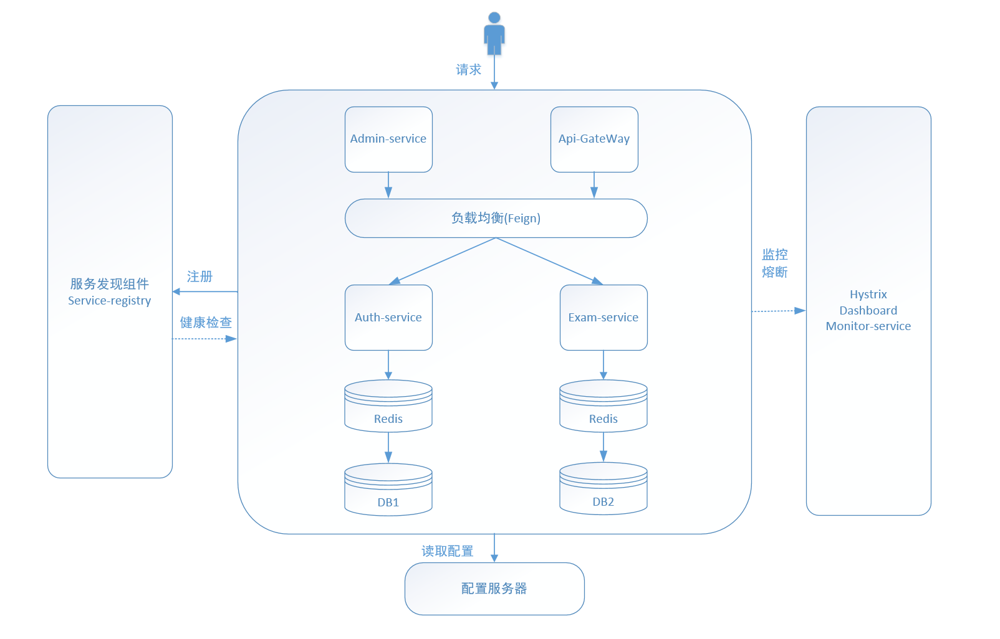
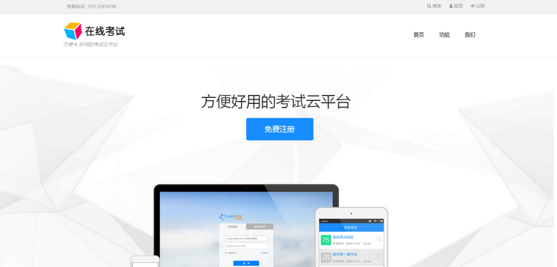
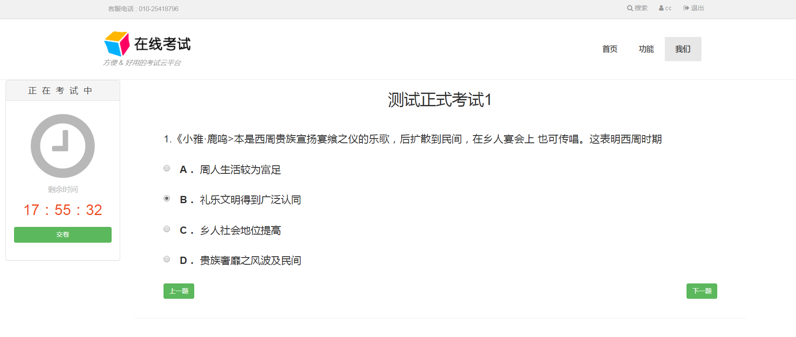
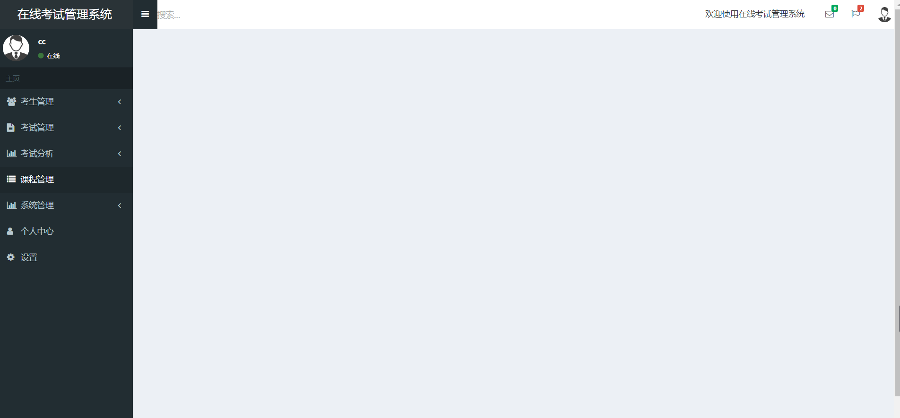
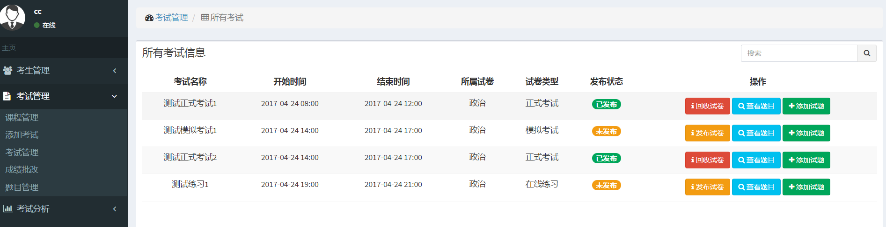
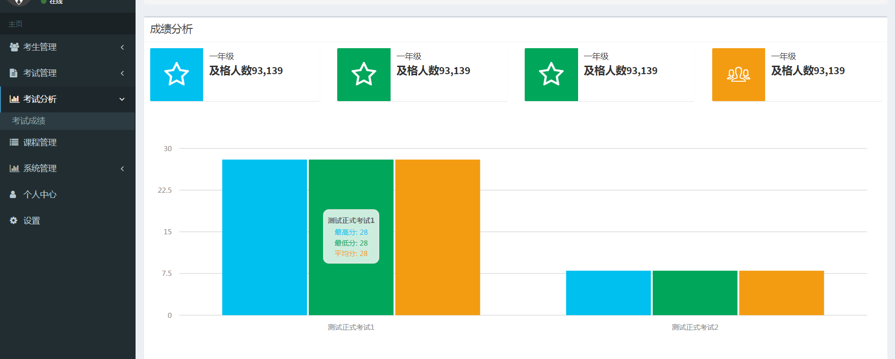
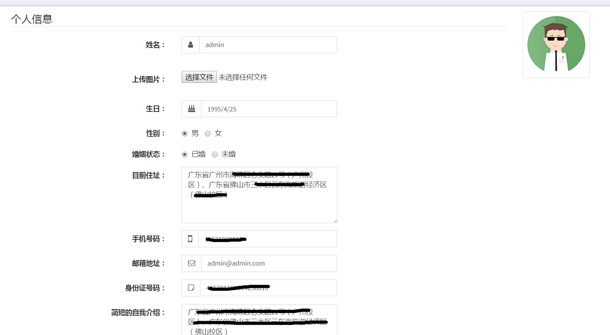

### 项目说明

大四的毕业设计，实现在线考试系统的基本功能。·

本系统采用IntelliJ IDEA作为开发工具，基于面向对象的程序设计和微服务架构设计思想，前端运用Html5，Bootstrap,AngularJs等技术完成系统页面的设计和开发，后端使用Java语言，Spring Boot,Spring Cloud,MyBatis等框架，结合MySQL数据库共同完成对信息增删查改操作。

### 系统架构

系统架构图

系统分为4个微服务，分别为Web前台网关服务，Web后台网关服务，授权服务，考试服务。

授权服务：
    
    基于OAuth2.0协议，集成Spring cloud security实现单点登录功能。同时作为资源服务器，提供用户信息的管理。

考试服务：
    
    作为资源服务器，提供考试信息的管理。

各服务名称和对应的端口号如下：

		service-registry		8761
		admin-server			8871
		api-gateway				8765
		auth-service			8769
		config-server			8870
		config-client			8872
		monitor-service			8873
		cache-service			8874

### 各服务 druid 监控台地址、用户名、密码

    auth-service   http://localhost:8871/auth/druid/index.html     admin           admin
    
    exam-service   http://localhost:8871/exam/druid/index.html     admin           admin

### 用户名、密码、角色

    admin               123456          管理员
    
    test                123456          学生，老师
    
    test1               123456          学生

### 考试流程：

1. 用户前台注册成为学生

2. 管理员后台添加老师，系统将该用户角色上升为老师

3. 老师登录，添加考试,添加题目，发布考试

4. 考生登录前台参加考试，交卷

5. 老师后台批改试卷，查看成绩

6. 考试查看成绩

### 练习流程：

1. 考生登录前台参加练习，练习完自动判分，记录错题

2. 考生查看成绩，查看错题

### 部分界面

前台

考试

后台

考试管理
 

考试分析（实现了部分）

个人资料

***

### 关于

作者：1633736729@qq.com

